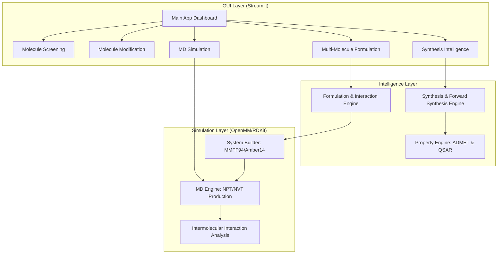

# 🛸 Chopper: InSilico Lab - System Architecture & Project State

**Version:** 2.0 (Post-Synthesis & Formulation Upgrade)  
**Date:** 2026-02-20  
**Objective:** A high-throughput, research-grade molecular discovery and simulation platform.

---

## 🏗️ System Architecture

The Chopper platform is built on a modular, vertically-integrated architecture that separates UI logic from physical simulation and chemical intelligence.

---

## 🚀 Core Pipelines

### 1. Molecular Dynamics (MD) Pipeline
The MD pipeline provides research-grade atomistic simulations to evaluate ligand stability and binding.
- **Protocol:** Minimization → NVT Equilibration → NPT Equilibration → Production MD.
- **Forcefield:** UFF/MMFF94 for solutes, Amber14/TIP3P for solvent.
- **Output:** DCD Trajectories, PDB Topologies, and RMSD/RMSF/RG analytics.

### 2. Synthesis Intelligence Pipeline
A dual-mode engine for retrosynthetic planning and virtual forward synthesis.
- **Retrosynthesis:** SAS scoring (1-10), ring strain heuristics, and SMARTS-based decomposition.
- **Forward Synthesis:** Controlled virtual reactions (Esters, Amides, Halogenation) with structural safety filters.
- **Safety Cap:** Automatic rejection of explosives (>2 Nitro groups) or unstable chain lengths.

### 3. Multi-Molecule Formulation Pipeline
Simulates complex mixtures (e.g., drug-excipient or drug-solvent) to detect aggregation.
- **Composition:** Normalizes mixtures to a 50-solute limit.
- **Multi-Solute Builder:** Dynamically merges unique XML forcefield parameters for each species.
- **Aggregation Analysis:** Calculates Aggregation Index and cluster size distributions from COM trajectories.

---

## 🛠️ Technology Stack
- **Framework:** Python 3.10+
- **Chemistry:** RDKit (Cheminformatics), OpenMM (Physics Engine)
- **UI:** Streamlit (Reactive Dashboarding)
- **Analysis:** MDTraj, Numpy, Scipy
- **Data Persistence:** JSON-based run logs and DCD trajectory storage.

---

## 📈 Current Project State
- [x] **Core MD Engine:** Stable (Demo & Research modes).
- [x] **ADMET Prediction:** Integrated with XGBoost models.
- [x] **Synthesis Module:** Fully implemented with Forward & Retro capabilities.
- [x] **Formulation Module:** Implemented with Multi-Solute OpenMM support.
- [x] **GUI:** Consolidated dashboard with 8 specialized tabs.

---

## 📂 Key Directory Structure
- `src/md/`: Physics engine, system building, and trajectory analysis.
- `src/synthesis/`: Accessibility scoring and virtual reaction rules.
- `src/formulation/`: Mixture parsing, scaling, and aggregation logic.
- `src/gui/`: Streamlit interface and tab-specific rendering logic.
- `data/`: Persistent storage for simulation results and synthesis logs.

---

> [!IMPORTANT]
> **Chopper** is designed as a "Virtual Lab" for structural hypothesis testing. All "Synthesizability" and "Stability" scores are predictive heuristics and should be verified in a wet-lab environment.
